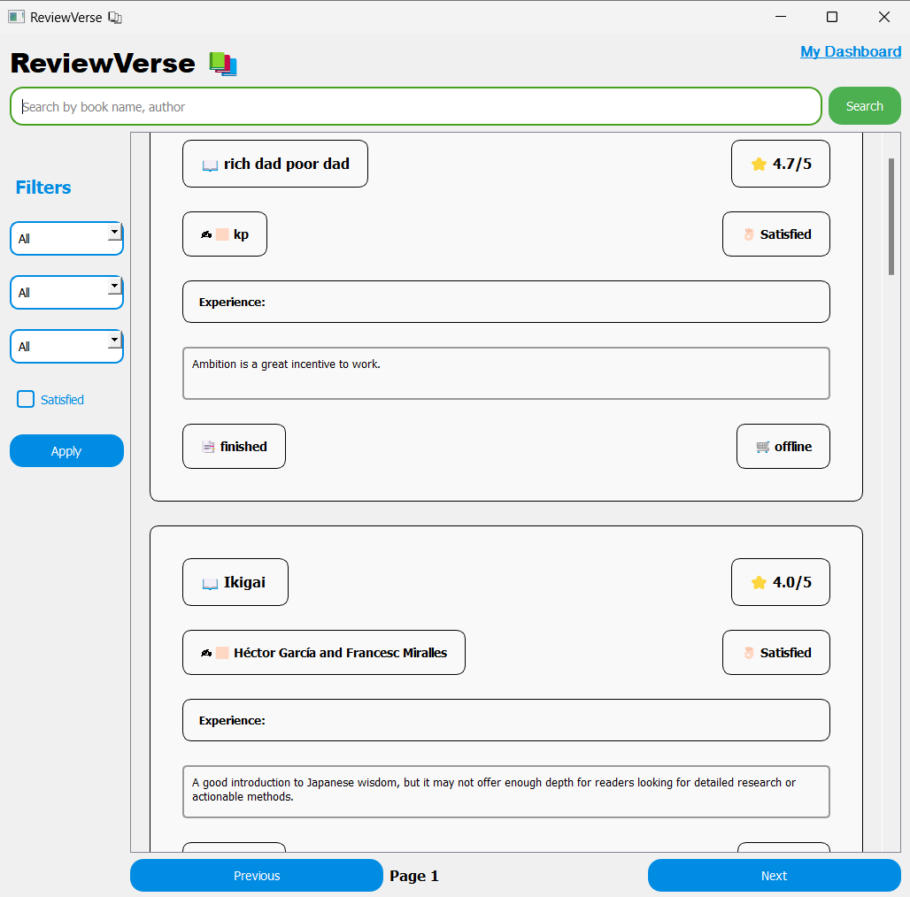

# ReviewVerse – A Universe of Book Reviews and Reader Experiences

## Project Overview
ReviewVerse is an interactive platform that allows book lovers to come together, share their thoughts, opinions, and reviews about the books they’ve read. The platform provides a space for readers to express their experiences, recommend new reads, and connect with like-minded individuals, fostering a vibrant community for book enthusiasts.

##

## User  Section 

### Login screen

### Registration screen

### Registration Sucess screen

### Eamil screen

### Login sucess screen

### User MainBoard

### User Dashboard

### Add Review

### Remove Review

##

## Admin  Section 

### Admin Login

### Admin Dashboard

### Admin user section

### Admin System Status

##

## Contributing
Feel free to fork the repository and submit pull requests to contribute to ReviewVerse. All contributions are welcome, whether for bug fixes, new features, or documentation improvements.

ReviewVerse is a space where book lovers connect, share their journeys through literature, and discover new worlds one review at a time. Happy reading! 📚✨
